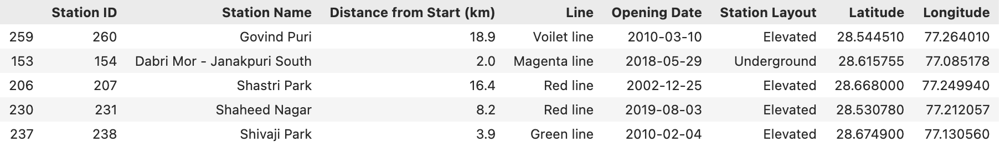

# Project of Data Visualization (COM-480)

| Student's name     | SCIPER |
| ------------------ | ------ |
| Najmeddine ABBASSI | 341889 |
| Verter STOILOV     | 328691 |
| Malen RAYCHEV      | 287015 |

[Milestone 1](#milestone-1) • [Milestone 2](#milestone-2) • [Milestone 3](#milestone-3)

## Milestone 1 (20th March)

### Visit the website online! :) **([link](https://uncharted-delhi.netlify.app/))**

### Dataset

For our project, we will use a combination of datasets describing the Delhi Metro Rail network:

- **[Delhi Metro Network (Kaggle)](https://www.kaggle.com/datasets/arashnic/metro-network-dynamics?resource=download)** is our main dataset, containing station names, line assignments, geographic coordinates (latitude/longitude), opening dates, and layout type (elevated/underground/at-grade) for all operational stations across 10 lines between 2002 and 2019.
- **[Delhi Metro Dataset (Kaggle)](https://www.kaggle.com/datasets/nikhilkumar766/delhi-metro-dataset)** is a complementary dataset used for additional station metadata (# of passengers, cost per passenger, ...).
- **[Wikipedia — List of Delhi Metro stations](https://en.wikipedia.org/wiki/List_of_Delhi_Metro_stations)** is scraped via the script `wikidata_scraping.ipynb` to enrich station entries with additional attributes not present in the Kaggle datasets (the main purpose is further completing the first dataset with the new stations opened after 2019).

  
*Sample examples from the **[Delhi Metro Network](https://www.kaggle.com/datasets/arashnic/metro-network-dynamics?resource=download)** dataset*

 The Kaggle datasets are well-structured and complete, with consistent column naming and no missing coordinates. There are minor issues, including a small number of inconsistent transliterations of station names, a few stations missing their opening year, and few stations missing that were opened recently. Therefore, preprocessing effort is relatively low, as the data is clean enough to begin visualization after a join between the datasets.

### Problematic

Delhi Metro is one of the world's largest and fastest-growing rapid transit systems, expanding to 400 km and serving over 10 million daily riders in just two decades. Yet no existing interactive visualization tells the story of this growth over time.

That is why we aim to build an animated map visualization that lets users explore four dimensions of the metro network's evolution:

1. **Spatial growth** : stations and lines appearing on an interactive map as the network expands.
2. **Temporal evolution** : an animated timeline (from 2002 to 2025) with a play/pause control and a year by year progression.
3. **Station-level detail** : clickable stations revealing metadata, images, and contextual information sourced from Wikipedia
4. **(OPTIONAL) Ridership trends** : traffic flow visualization overlaid on the map, including year-over-year changes and the COVID-19 impact. This point will be very tough to implement due to the lack of public informations on the metro station repartiton of the ridership.

Ideally, the target audience would be urban planning enthusiasts, transit researchers, data visualization students, and Delhi residents interested in the history of their metro system.

### Exploratory Data Analysis

Full analysis and statistics are available in [data/dataExploration.ipynb](data/dataExploration.ipynb).

### Related Work

- **Existing Work and Originality**  
While there are numerous open-source datasets regarding the New Delhi Metro on platforms like Kaggle (such as the [Metro Network Dynamics dataset](https://www.kaggle.com/datasets/arashnic/metro-network-dynamics)), what others have already done with the data is mainly static. Existing projects mostly focus on basic Exploratory Data Analysis ([example 1](https://www.kaggle.com/code/rahulsatti/delhi-metro-analysis), [example 2](https://www.kaggle.com/code/arunjangir245/delhi-metro-brief-eda)), predictive modeling and clustering ([example 3](https://www.kaggle.com/code/kunalgupta2616/clustering-dmrc-stations)), or graph theory applications. Similarly, the [official DMRC map](https://www.delhimetrorail.com/network_map) provides only a static schematic diagram, lacking both true geographic accuracy and historical context. Even existing interactive tools, such as the [Delhi Metro Interactive Legend](https://www.arcgis.com/apps/instant/interactivelegend/index.html?appid=97844910afda457a942bb68499932f83) built on ArcGIS, offer only a baseline of geographic filtering that our visualization aims to go far beyond.

Our approach is original because it shifts the focus from static analytics to an interactive, spatio-temporal narrative. Specifically, we are combining three elements not found together in existing work: a geographically accurate interactive map over the real city street grid, an animated timeline of the network growth, and a per-station detail panel surfacing construction type, interchange connections, and nearby landmarks.

- **Sources of Inspiration**  
Our work took inspiration from highly effective transit visualizations, drawing primarily from these sources:
  - **[Danny Yang's NYC Subway Visualization](https://yangdanny97.github.io/nyc-subway-vis/):** This interactive geographic visualization heavily inspired our approach to mapping time-series data onto a spatial grid. In particular, its clean integration of timeline controls, which allow users to scrub through time and watch the network's dynamics visually unfold.
  - **[Rome Metro vs. Actual Geography](https://www.reddit.com/r/MapPorn/comments/11r1wfh/rome_subway_map_vs_actual_geography/):** This visualization compares a schematic metro map to the real geographic layout of the city. 
  - **[NYC Subway Artists Map](https://www.arcgis.com/apps/MapJournal/index.html?appid=b8f3d64c23ba49a2a7cc1c35b5a044d0):** This interactive map of street performers across NYC stations serves as a strong inspiration for our per-station detail panels, showing us how to successfully layer specific, localized data on top of a broader transit network.

## Milestone 2 (17th April, 5pm)

**10% of the final grade**

**PDF : [Milestone 2](./Milestone2.pdf)**

## Milestone 3 (29th May, 5pm)

**80% of the final grade**

See the [README.md](./Milestone2.pdf) for more information about running the website locally and the dependencies needed.

## Late policy

- < 24h: 80% of the grade for the milestone
- < 48h: 70% of the grade for the milestone
